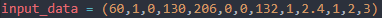
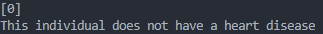

# Heart Disease Predictor
   

## Description
A machine learning application that uses a number of metrics to predict whether an individiual has heart disease or not. The prediction model is created using data from UCI (University of California, Irvine) found on Kaggle.

## Table of Contents
1. [Installation](#installation)
2. [Usage](#usage)
3. [License](#license)
4. [Questions](#questions)

## Installation
`git clone` this repo 
Open a new terminal and run `pip install numpy && pandas`

## Usage
To run the program simply navigate to the index.py file and run the python script. 
Feel free to change the input data found on line 71 to see various different results. 
Below is an example of input data and its corresponding output for an individual who does not have heart disease.

## License
This project is licensed under mit 
https://opensource.org/licenses/MIT

## Questions
If you have any additional questions regarding this project please contact me at maduraigurveer@gmail.com.
You can view more of my work at https://github.com/gurveerm